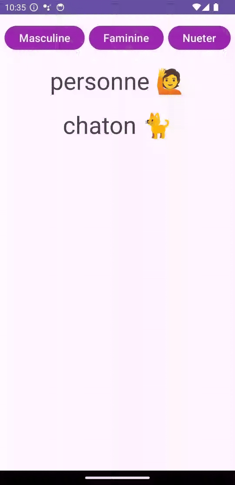

# Android 14 Features
- ScreenShot Detection API done ✅
  
  
  
- Grammatical inflection API done ✅

  
  
- ShareSheet Custom Actions done ✅

  
  
- Predictive BackGesture done ✅
  
  

## Regional preferences TODO

## More permissions TODO

